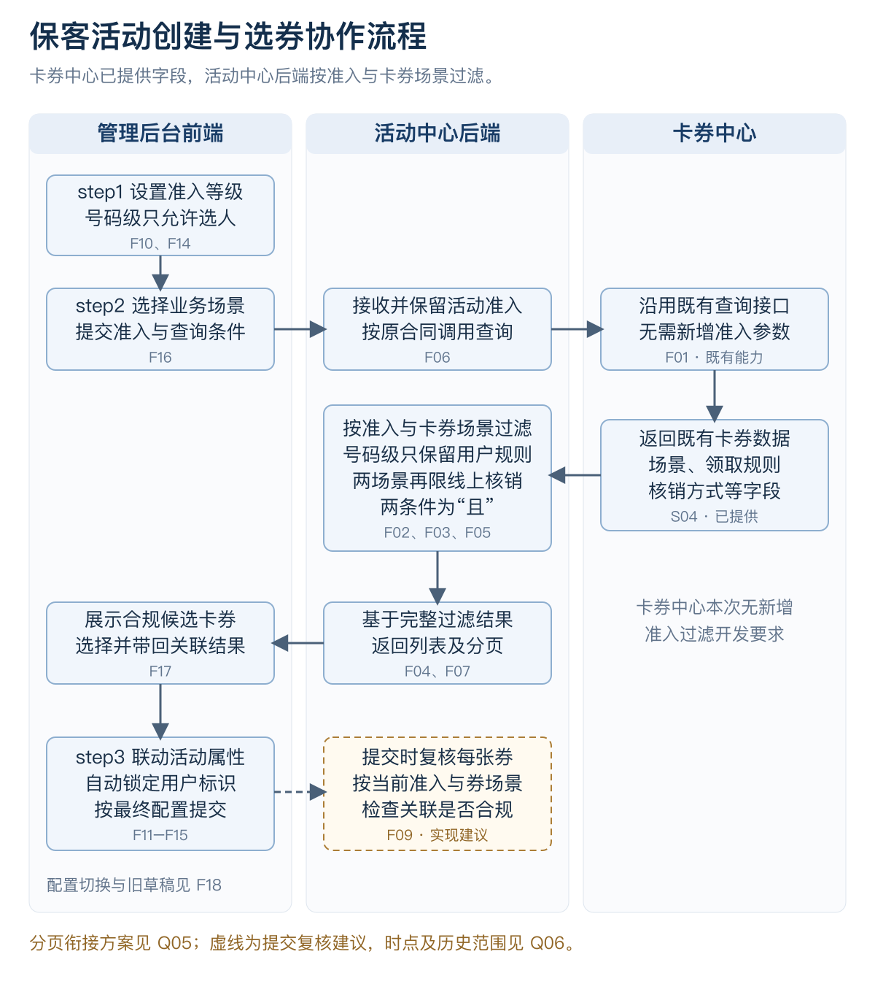
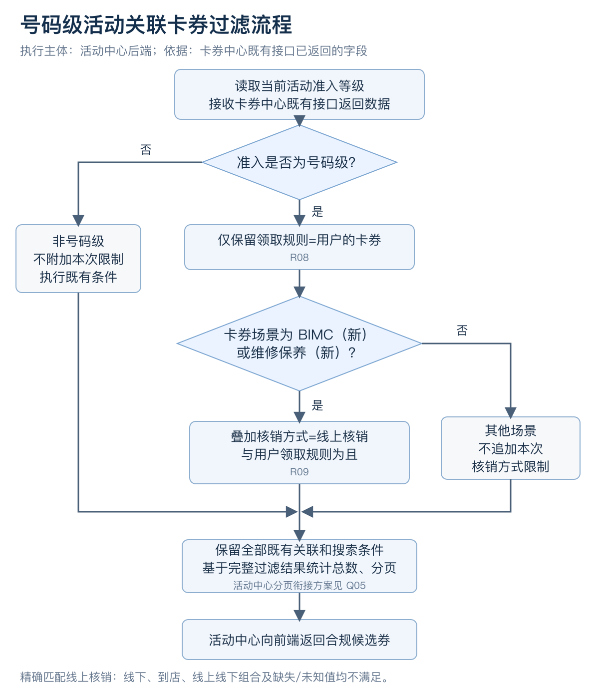

# 保客活动号码级准入联动需求说明

版本：V1.1　日期：2026-09-10

## 系统分工与本次改动

卡券中心现有接口已提供业务场景、领取规则、核销方式等字段。活动中心后端读取这些字段并按准入与场景过滤，再将合规候选结果返回管理后台；前端调整准入位置、活动属性默认值与展示。本次无需新增卡券中心过滤接口或向其传入准入等级。

号码级全部场景要求领取规则=用户；BIMC（新）、维修保养（新）另须核销方式恰为线上核销，两者为且。线下、到店、组合、缺失及未知核销方式不满足这两类场景的精确匹配。其他既有关联条件继续执行。

## 流程图

## 已确认规则

| 编号 | 规则 |
|---|---|
| R01 | 准入配置前移至step1活动状态上方 |
| R02 | 活动属性单选：选人、选车、选人+车 |
| R03 | C端主动参与默认选车；商城周边默认选人 |
| R04 | 用户行为触发、商城售后与商城周边属性非必填 |
| R05 | 商城售后与商城周边复选，仅可选择交集选人 |
| R06 | 选人锁定oneid；选车锁定VIN；人+车锁定两者 |
| R07 | 人+车两标识为且；号码级只允许选人，优先于默认值 |
| R08 | 号码级仅可关联领取规则为用户的卡券 |
| R09 | 号码级BIMC（新）、维修保养（新）另须核销方式恰为线上核销 |

优先级：号码级可选范围 → 商城复选交集 → 类型默认值。必填性独立判断。商城周边单选与非号码级C端的额外禁选范围仍待确认。

## 功能清单

| 编号 | 系统 | 功能 | 变更说明 | 确认层级 | 依据 | 验收场景 |
|---|---|---|---|---|---|---|
| F01 | 卡券中心 | 沿用既有卡券查询接口 | 现有接口已向活动中心提供业务场景、领取规则、核销方式等字段。本项为既有能力复用，本次无需新增卡券中心过滤接口或准入传参。 | 既有能力，用户已确认 | S04 | AC21 |
| F02 | 活动中心后端 | 按领取规则过滤 | 读取卡券中心返回的领取规则。号码级活动全部场景仅保留领取规则为用户的卡券，与既有关联条件共同生效。 | 已确认 | S01、S04；R08 | AC11、AC14、AC15 |
| F03 | 活动中心后端 | 按业务场景过滤核销方式 | 读取卡券自身业务场景及核销方式。号码级且场景为BIMC（新）或维修保养（新）时，仅保留核销方式恰为线上核销的券，与用户领取规则为且。 | 已确认 | S02、S04；R09 | AC11—AC14、AC16 |
| F04 | 活动中心后端 | 统一搜索与分页口径 | 搜索、刷新、重置和翻页持续应用号码级规则。建议由活动中心基于完整过滤结果计算总数与分页；既有接口分页的衔接方案见Q05。 | 规则及责任已确认，分页方案待对齐 | S01、S02、S04；R08、R09 | AC17、AC19 |
| F05 | 活动中心后端 | 映射既有返回字段 | 复用卡券中心已提供的场景、领取规则和核销方式，按既有接口的正式字段及枚举识别业务含义，供活动中心过滤及前端展示。 | 字段已提供，映射待研发对齐 | S04 | AC21 |
| F06 | 活动中心后端 | 保留活动准入查询上下文 | 接收管理后台的当前准入与查询条件，在活动中心保留准入供过滤使用。按既有合同调用卡券中心查询接口，无需向其新增传递准入等级。 | 责任已确认，对接细节待对齐 | S04 | AC17、AC21 |
| F07 | 活动中心后端 | 返回活动中心过滤结果 | 活动中心执行F02、F03后向管理后台返回合规候选券，并按约定返回过滤后的总数与分页信息。不得补回已排除的卡券。 | 过滤责任已确认，分页方案待对齐 | S04；R08、R09 | AC11、AC21 |
| F08 | 活动中心后端 | 处理异常和旧调用兼容 | 需约定管理后台未传等级、未知枚举、历史草稿及既有接口异常的处理。建议号码级查询失败时提示重试，不降级展示未过滤列表。 | 实现建议，兼容策略待确认 | J01、S04 | AC22 |
| F09 | 活动中心后端 | 提交时复核已关联卡券 | 建议活动中心按当前准入及每张券自身场景复用过滤规则，避免等级切换、旧草稿或券配置变化绕过限制。复核触发时点与查询复用方式见Q06。 | 实现建议，时点与范围待确认 | J01、S04 | AC18、AC20 |
| F10 | 管理后台前端 | 前移准入配置 | 将step3整个准入配置移到step1启停用上方，当前字段名为活动状态。step3不保留重复配置。 | 已确认，展示范围待确认 | S01；R01 | AC01 |
| F11 | 管理后台前端 | 设置活动属性默认值 | 活动属性为单选。C端主动参与活动默认选车，商城周边默认选人；默认值须落在最终允许范围内。 | 已确认，额外禁选待确认 | S01；R02、R03 | AC02、AC03 |
| F12 | 管理后台前端 | 保留非必填规则 | 用户行为触发、商城售后、商城周边的活动属性非必填。允许清空，清空后用户标识不保留旧勾选。 | 已确认 | S01；R04 | AC03、AC04、AC07 |
| F13 | 管理后台前端 | 计算复选活动的属性交集 | 同时选择商城售后与商城周边时，只可选交集选人，选车和选人+车禁用，仍保持非必填。 | 已确认 | S01；R05 | AC05 |
| F14 | 管理后台前端 | 限制号码级活动属性 | 准入为号码级时只允许选人，覆盖C端默认选车；是否必填仍由活动类型独立决定。 | 已确认 | S01；R07 | AC06、AC07 |
| F15 | 管理后台前端 | 联动并锁定用户标识 | 选人对应oneid，选车对应VIN，选人+车对应oneid与VIN，自动勾选且不可编辑。人+车两字段为且。 | 已确认 | S01；R06、R07 | AC08—AC10 |
| F16 | 管理后台前端 | 联动关联卡券查询 | 将当前准入、场景、搜索和分页条件提交给活动中心后端，搜索、重置、刷新、翻页保持当前准入。只展示活动中心过滤后的候选结果。 | 方向已确认，对接细节待对齐 | S04；R08、R09 | AC17、AC21 |
| F17 | 管理后台前端 | 展示关联券及适用限制 | 号码级显示用户领取规则限制，并提示两类场景仅线上核销。选择后建议展示领取规则和核销方式供复核。 | 规则已确认，展示为原型方案 | S01、S02；R08、R09 | AC11、AC18 |
| F18 | 管理后台前端 | 处理配置切换与旧草稿冲突 | 原型采用属性自动纠正、冲突券保留可见并提示原因，要求重选或移除，拦截继续和保存。正式清空或保留策略待确认。 | 原型建议，正式策略待确认 | J01 | AC18、AC20 |

## 验收场景

| 编号 | 功能 | 操作或前提 | 预期 | 确认层级 |
|---|---|---|---|---|
| AC01 | F10 | C端主动参与活动进入step1和step3 | 准入配置位于step1活动状态上方，step3无重复区。 | 已确认规则 |
| AC02 | F11 | 非号码级C端主动参与活动新建 | 活动属性默认选车，用户标识VIN锁定。额外禁选范围见Q02。 | 默认值已确认 |
| AC03 | F11、F12 | 商城周边活动新建 | 属性默认选人，oneid锁定；属性非必填，可清空。 | 已确认规则 |
| AC04 | F12 | 用户行为触发或商城售后，清空属性 | 可保持空值且无必填错误；用户标识不保留上次值。空值执行语义见Q07。 | 已确认规则 |
| AC05 | F13 | 同时勾选商城售后与商城周边 | 只可选人，选车和选人+车禁用；允许清空。 | 已确认规则 |
| AC06 | F14 | C端主动参与活动选择号码级 | 默认选人且其余选项禁用，oneid锁定，覆盖默认选车。 | 已确认规则 |
| AC07 | F12、F14 | 号码级与非必填类型组合 | 若Q01确认准入覆盖该类型，仍允许空值；有值时只能选人。 | 待Q01确定可达范围 |
| AC08 | F15 | 选择选人 | oneid自动勾选且不可编辑。 | 已确认规则 |
| AC09 | F15 | 选择选车 | VIN自动勾选且不可编辑。 | 已确认规则 |
| AC10 | F15 | 选择选人+车，分别模拟一个标识不一致 | 界面同时锁定oneid和VIN；真实发券/领券仅在二者均一致时通过。服务端执行另行联调。 | 已确认规则，服务联调待执行 |
| AC11 | F02、F03、F07、F17 | 号码级，分别查询两类场景，用户规则且仅线上核销 | 活动中心保留并返回给管理后台；仍须满足既有关联条件，可查询、勾选并关联。 | 已确认规则 |
| AC12 | F03 | 号码级，两类场景，用户规则且线下或到店核销 | 活动中心从接口返回数据中排除该券，不返回给管理后台，不允许关联。 | 已确认规则 |
| AC13 | F03 | 号码级，两类场景，用户规则且组合、缺失或未知核销方式 | 活动中心按精确值过滤，均不等于线上核销，不返回给管理后台。边界样本不代表正式接口枚举。 | 精确匹配边界 |
| AC14 | F02、F03 | 号码级，两类场景，VIN规则且线上核销 | 活动中心判定不满足用户规则，排除该券，不返回给管理后台，不允许关联。 | 已确认规则 |
| AC15 | F02 | 号码级，本次未列明其他场景，用户规则 | 执行既有条件，不附加本次两类场景的核销限制。 | 本次规则范围 |
| AC16 | F03 | 非号码级，查询各场景 | 执行既有规则，不附加本次号码级专属过滤。 | 本次规则范围 |
| AC17 | F04、F06、F16 | 号码级执行券ID/名称搜索、重置、刷新、翻页 | 活动中心过滤条件持续生效，前端无不合规券；建议总数和分页均基于完整过滤结果。既有接口分页衔接见Q05。 | 规则及责任已确认，分页方案待对齐 |
| AC18 | F09、F17、F18 | 已选VIN券或两类场景线下券后切为号码级 | 原型显示具体冲突，要求重选或移除，不能保存不合规关联。正式交互见Q04。 | 原型建议 |
| AC19 | F04 | 号码级搜索无符合条件的券 | 建议活动中心返回空集合、总数0，前端显示无符合条件卡券；不得直接沿用过滤前总数。格式按两端约定。 | 实现建议 |
| AC20 | F09、F18 | 旧草稿恢复或选券后券配置变化再提交 | 建议活动中心按当前准入和券自身场景复核并拦截冲突，触发时点与历史范围见Q06。 | 实现建议 |
| AC21 | F01、F05、F06、F07、F16 | 卡券中心既有接口返回场景、领取规则、核销方式，活动中心读取当前准入 | 既有字段映射正确，活动中心按R08、R09过滤并返回前端；无需新增卡券中心过滤接口或向其传入准入等级。 | 字段及责任已确认，联调待执行 |
| AC22 | F08 | 既有接口超时、未知枚举或管理后台旧调用未传准入 | 按Q05约定处理；建议号码级失败不降级展示未过滤数据。 | 兼容与异常策略待确认 |

## 待确认事项

| 编号 | 事项 | 待确认内容 | 参与方 |
|---|---|---|---|
| Q01 | 准入展示范围 | 目前原型沿用C端主动参与活动可见。是否扩展至用户行为触发、商城及其他活动类型。 | 产品 |
| Q02 | 非号码级C端禁选范围 | 默认选车已确认。SIT额外禁用选人和选人+车是否保留，需要明确。 | 产品 |
| Q03 | 商城周边单选的可选范围 | 默认选人已确认；是否同时禁止另外两项未独立确认。当前原型保留原有禁选表达，不能据此扩大规则。 | 产品 |
| Q04 | 切换时的旧选择 | 属性自动纠正和冲突券保留提示为原型方案。正式采用自动清空、保留待修正还是切换确认。 | 产品 |
| Q05 | 既有字段映射与分页衔接 | 字段已提供。需对齐既有正式字段与枚举映射、上游分页数据如何形成完整过滤结果及总数，以及活动中心异常和未传准入的兼容策略。 | 活动中心后端，卡券中心协助既有合同对齐 |
| Q06 | 提交复核与历史数据 | 活动中心提交复核的触发时点、既有查询复用方式，以及历史活动编辑、复制、草稿的兼容范围。过滤责任已明确归活动中心。 | 产品与活动中心后端 |
| Q07 | 非必填空值的执行语义 | 属性为空时的真实发放/领取逻辑沿用何种既有处理；不能由原型自行兜底为手机号、oneid或VIN。 | 产品与活动中心后端 |
| Q08 | 后续场景扩展 | 本次精确线上核销限制仅点名BIMC（新）和维修保养（新）。其他同类场景如需扩展应补充明确清单。 | 产品与活动中心后端 |

## 需求依据

| 编号 | 来源 | 内容 |
|---|---|---|
| S01 | 用户首次调整要求 | 准入前移、属性单选与默认值、非必填、商城交集、用户标识、号码级选人及用户领取规则。 |
| S02 | 用户线上核销补充 | BIMC（新）和维修保养（新）仅线上核销可关联号码级活动。 |
| S03 | 初次职责讨论 | 管理后台位置及默认值调整仍有效；原卡券中心过滤分工已由S04替代，不作为当前实施依据。 |
| S04 | 用户最新职责确认 | 卡券中心已通过现有接口向活动中心提供所需字段，由活动中心过滤即可。本次不要求新增卡券中心过滤能力。 |
| J01 | 本次评审建议 | 分页衔接、提交复核时点、异常兼容与旧选择处理；具体实施方案或交互策略待确认。 |

## 交付说明

原型增加8处可折叠右侧标注，点击编号或定位字段可查看页面位置。原型为本地Mock演示；真实接口、SIT、发券领券和历史活动兼容另行联调验收。Word文档包含接口业务语义与详细规则说明。
